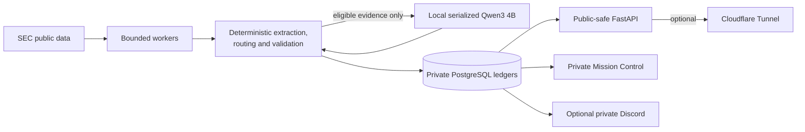

# Kalki Market Intelligence

Kalki is a self-hosted, evidence-first research system for public-company filings.
It discovers selected SEC filings, constructs bounded primary-source evidence, runs
deterministic screening and validation, and selectively asks a pinned local Qwen
model for structured analysis. Only findings that pass the active source, quotation,
numeric, provenance, and publication gates can become a public dossier.

> [!CAUTION]
> Kalki is market-intelligence software—not a stock picker, broker, automatic trading
> system, investment adviser, or promise of performance. “Qualified” means a filing
> passed publication gates. It does not mean buy, sell, outperform, or safe.

## Status

**Observation Baseline V2 (Phase 45) is accepted and frozen.** Feature development is
paused so operational evidence can accumulate without changing the model, prompts,
schema, thresholds, or evaluation rules. The production analyst is serialized
`qwen3:4b` at an exact digest. The optional Gemma verifier, model concurrency,
prospective market-data provider, and automatic outcome worker remain disabled.

The source tree is licensed under Apache-2.0 and has a sanitized, clean-history
export procedure. The historical private engineering repository remains private and
is not the proposed public history. Repository creation, GitHub-side security review,
tagging, pushing, and any visibility change remain explicit owner actions. See the
[public release audit](docs/PUBLIC_RELEASE_AUDIT.md) and
[release-candidate manifest](docs/PUBLIC_RELEASE_CANDIDATE.md).

## What is implemented

- SEC daily-index, filing, submissions, and CompanyFacts/XBRL ingestion with UTC
  availability/retrieval provenance and canonical identity validation.
- Form-aware bounded evidence extraction, source grading, exact quotations, hashes,
  deterministic numeric checks, filing diffs, and conservative forensic detectors.
- Tier-0 `SKIP`/`RETAIN`/`ESCALATE` compute routing, evidence budgets, identical-work
  caching, and durable attempt/funnel/engineering receipts.
- Two closed Qwen roles (catalyst and bull/bear/risk), strict structured response
  validation, and fail-closed terminal dispositions.
- Immutable qualified briefs, validated SEC links, public-safe screened-out records,
  and idempotent Discord delivery.
- Separate public `/radar`, `/research`, and `/screened` pages and authenticated
  loopback-only Mission Control.
- Private, optional allowlisted Discord research intake with immutable lead, feedback,
  result, provenance, and delivery history.
- Deterministic ownership, financing/dilution, accounting/auditor/compliance,
  event-novelty, filing-change, contradiction/convergence, Focus, and prospective-
  outcome foundations.
- PostgreSQL migrations through 0027, immutable-history protections, backup/restore
  gates, hardened Compose services, and extensive unit/integration/lifecycle tests.

## What is not implemented or enabled

- No brokerage connection, order execution, portfolio management, or auto-trading.
- No demonstrated investment performance; prediction and outcome samples are empty,
  so the truthful state is `INSUFFICIENT_SAMPLE`.
- No comprehensive live Canadian SEDAR+ ingestion.
- No enabled live market-data provider or paid prerequisite.
- No enabled Gemma verifier or concurrent model requests.
- No claim that a larger local model is inherently better.
- No public human-research content, admin telemetry, prompts, raw model output,
  credentials, or internal errors.

## Architecture



PostgreSQL and Ollama have no host port. Admin and public origins bind only to
loopback; the optional connector network can reach the public process but not admin,
database, or model. Application containers are non-root, read-only, capability-
dropped, resource-limited, and supplied secrets by ignored read-only files.

Read the [complete technical guide](docs/KALKI_COMPLETE_GUIDE.md) for the full
filing-to-dossier lifecycle, ledgers, migrations, subsystem boundaries, and Phase
1–45 history.

## Getting started

Do not deploy a moving branch. Once the owner approves a sanitized public release,
choose its immutable tag/commit and follow the
[beginner installation guide](docs/INSTALLATION_GUIDE.md). It covers Linux, Docker,
secrets, PostgreSQL, Ollama/Qwen, local-only startup, health checks, backups,
updates, rollback, troubleshooting, and uninstall.

For development after cloning an approved revision:

```bash
python3 -m venv .venv
.venv/bin/python -m pip install --require-hashes -r requirements-dev.lock
.venv/bin/pytest
.venv/bin/ruff check .
.venv/bin/mypy
```

Use a repository-local environment; never modify system Python. Detailed alternatives
and current interpreter notes are in [Development](docs/DEVELOPMENT.md).

## Documentation map

| Document | Start here when you want to… |
|---|---|
| [Complete technical guide](docs/KALKI_COMPLETE_GUIDE.md) | Understand what Kalki actually does, its flows, ledgers, migrations, and limitations |
| [Beginner installation guide](docs/INSTALLATION_GUIDE.md) | Install safely on another Ubuntu/Debian server |
| [Hardware and scaling](docs/HARDWARE_AND_SCALING.md) | Compare minimum, tested, recommended, and experimental hardware |
| [Operations guide](docs/OPERATIONS_GUIDE.md) | Start, stop, monitor, back up, restore, and troubleshoot |
| [Security model](docs/SECURITY_MODEL.md) | Understand threats, trust boundaries, and deployment controls |
| [Security policy](SECURITY.md) | Report a vulnerability privately |
| [Public release audit](docs/PUBLIC_RELEASE_AUDIT.md) | Review blockers before any visibility change |
| [Release-candidate manifest](docs/PUBLIC_RELEASE_CANDIDATE.md) | Create and verify the clean one-commit public export |
| [Third-party licenses](docs/THIRD_PARTY_LICENSES.md) | Review dependency, runtime, model, and fixture terms |
| [Architecture](ARCHITECTURE.md) | Read the original architecture contract and ADRs |
| [Project specification](docs/PROJECT_SPEC.md) | Review detailed product requirements and accepted constraints |
| [Phase 45 baseline](docs/PHASE45_OBSERVATION_BASELINE_V2.md) | Inspect the frozen acceptance manifest |
| [Production deployment](docs/PRODUCTION_DEPLOYMENT.md) | Use the existing operator-focused production runbook |
| [Contributor guide](CONTRIBUTING.md) | Propose measured, evidence-preserving changes |
| [Roadmap](ROADMAP.md) | Understand historical sequencing; not current authorization |

Subsystem documents under `docs/` provide deeper acceptance evidence for SEC
ingestion, the analyst pipeline, model benchmarking, Discord, web, market data,
signals, backtesting, forensics, ownership, financing, accounting, filing changes,
convergence, and outcome science.

## Contributing

Observation Baseline V2 is feature-frozen. Security fixes, correctness defects,
documentation, and measured proposals must follow [CONTRIBUTING.md](CONTRIBUTING.md).
Do not open a public issue containing a vulnerability, credential, private research,
production log, or identifier; follow [SECURITY.md](SECURITY.md).

## License

Owner-authored Kalki project source and documentation are licensed under the
[Apache License 2.0](LICENSE). Dependencies, model weights, container/runtime
components, provider data, trademarks, and third-party source material retain their
own licenses or terms; see [third-party licenses](docs/THIRD_PARTY_LICENSES.md).
Repository visibility is a separate owner decision and has not been changed by this
preparation work.

## Disclaimer

Kalki provides software and evidence organization for research/education. Source
filings can be incomplete or amended; parsers and models can fail; public pages can
be stale; absence of an alert is not absence of an event. Verify primary sources and
seek appropriately qualified professional advice before making financial, legal,
security, or operational decisions.
