# Kalki Market Intelligence: complete technical guide

**Accepted system boundary:** Observation Baseline V2, Phase 45
**Audience:** first-time readers, developers, defenders, self-hosters, and researchers
**Status labels used here:** **Implemented**, **Optional**, **Disabled**,
**Experimental**, **Historical**, **Planned/not implemented**, and **Unavailable**

This guide describes the accepted source and database through migration `0027`.
Where an older document conflicts with that implementation, the accepted Phase 45
baseline wins. For installation, operations, hardware, and security procedures, see
the [installation guide](INSTALLATION_GUIDE.md),
[operations guide](OPERATIONS_GUIDE.md),
[hardware guide](HARDWARE_AND_SCALING.md), and
[security model](SECURITY_MODEL.md).

Owner-authored project source and documentation are licensed under Apache-2.0.
Dependencies, runtimes, models, SEC source material, and optional services retain
their own terms; see [third-party licenses](THIRD_PARTY_LICENSES.md).

## 1. What Kalki is

Kalki is a local-first market-intelligence and evidence system. It watches selected
public SEC filing feeds, constructs bounded primary-source evidence, applies
deterministic screening and validation, and uses a local language model only where
the deterministic path says analysis is justified. A filing may become a public
research dossier only after its claims, quotations, numbers, source identity, and
publication contract pass closed validation.

The system is designed to answer a narrower question than “what stock should I
buy?”: **what did an issuer disclose, what evidence supports a carefully bounded
interpretation, what could not be established, and how did the system reach its
terminal disposition?** It also keeps append-only receipts that make later review
possible.

### What Kalki does not claim

- It is not a broker, portfolio manager, financial adviser, or automatic trader.
- It never places orders and has no brokerage connectivity.
- A public dossier is not a recommendation, target price, or prediction of return.
- “Qualified” means publication gates passed, not that an issuer is good or its
  security will rise.
- “Screened out” means a completed evaluation found no publishable validated
  finding under the active policy. It is not a negative investment rating.
- Model output is not fact merely because it is fluent or schema-shaped.
- The project has no demonstrated investment performance. The accepted database
  has no prediction/outcome sample, so outcome science reports
  `INSUFFICIENT_SAMPLE`.
- Canadian SEDAR+ production ingestion, live licensed market data, automatic
  trading, portfolio construction, and public human-research publication are not
  implemented.

## 2. Design principles

### Evidence first

Every public claim must lead back to a source document, source hash, bounded exact
quotation, accession identity, and retrieval/availability times. A conclusion with
no valid evidence is discarded, even when a model produced it confidently.

### Deterministic before AI

Parsing, identity checks, point-in-time rules, filing diffs, numeric comparison,
XBRL matching, source grading, routing, scoring, and outcome arithmetic are ordinary
tested code. The local model performs constrained semantic analysis; it does not do
financial arithmetic, decide database identity, invent missing facts, or bypass a
failed validation.

### Fail closed

Ambiguity becomes `UNKNOWN`, `UNVERIFIABLE`, `SCREENED_OUT`, retry, or
`ANALYSIS_INCOMPLETE`—never a guessed fact. Publication requires positive evidence
that every gate passed. Missing validation is not treated as validation.

### Point-in-time correctness

Kalki distinguishes when an event occurred, when a publisher made it available,
when Kalki retrieved it, and when Kalki recorded or evaluated it. Evaluation may use
only evidence available at the relevant decision time. Reconstructed history is
kept separate from genuinely forward observations. These rules reduce look-ahead
bias; they do not magically eliminate all dataset bias.

### Immutable history with mutable heads

Queue “head” tables may change state so workers can claim and retry work. Decisions,
attempts, disclosures, membership events, model reviews, outcomes, and delivery
receipts are append-only or protected against update/delete. A correction appends a
new fact linked to the superseded one. It does not silently rewrite what happened.

### Zero-cost and self-hosted

The core accepted path uses the public SEC endpoints, PostgreSQL, local Ollama/Qwen,
and Docker on hardware the operator already owns. Electricity, Internet access,
storage wear, a domain, and optional account services are still real operator costs.
Cloudflare Tunnel and Discord are optional. The optional market-data adapter is
disabled because live use requires an account and terms/rights decision.

### Public/private separation

Public pages receive only public-safe projections. Admin telemetry, login/session
state, worker errors, prompts, raw model responses, Discord identity, human
hypotheses, feedback, and private results remain on private paths and private
tables. “Not rendered in a template” is insufficient; public SQL queries avoid
selecting sensitive columns in the first place.

## 3. Architecture at a glance

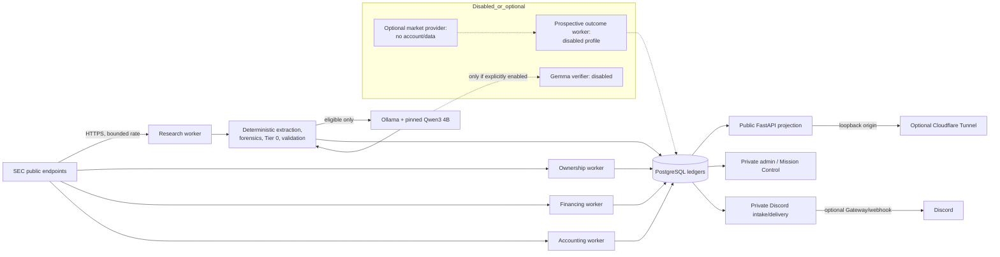

### Deployment and network boundaries

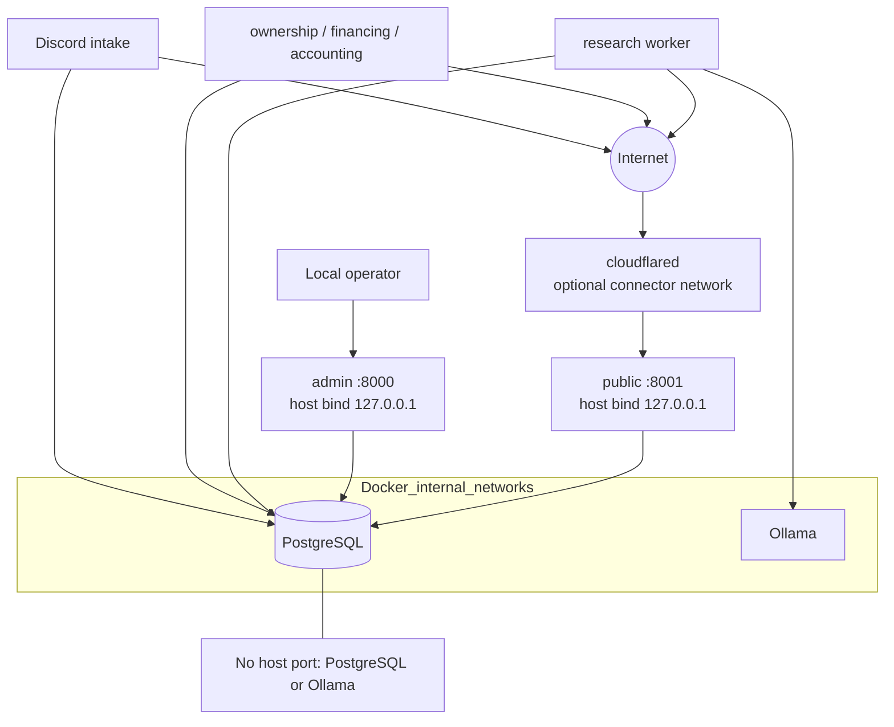

The production Compose file separates database, analyst, admin, public-connector,
and outbound-research networks. Database and analyst networks are marked internal.
Only the public and admin web processes publish host ports, both on loopback. The
optional tunnel container can reach the public process but not PostgreSQL, Ollama,
or admin. See [Security Model](SECURITY_MODEL.md) for the exact trust analysis.

## 4. The autonomous SEC research path

### Step 1: discover, normalize, and identify

The research worker polls the SEC daily master index using a descriptive
`User-Agent` and a conservative configured rate. It maps eligible filing rows to a
validated `SecFilingRecord`: canonical ten-digit CIK, accession number, form,
issuer, filing/acceptance time where available, and canonical archive URL. Candidate
identity is accession-based, so rediscovery does not create another logical filing.

The worker inserts or observes a durable candidate, claims a bounded batch with
PostgreSQL locking, and records a research run. Stale claims and `retry_wait` states
are recoverable without treating a claim as a completed attempt.

### Step 2: retrieve and bound the filing

The SEC client accepts only HTTPS SEC hosts and known EDGAR archive/data paths. It
enforces response-size, timeout, content, and rate limits. Canonical complete-
submission paths may contain the accession directory introduced by migration 0023.
Visible text is parsed and reduced to form-aware/keyword evidence windows. This
keeps prompts bounded and prevents sending an entire filing to the model.

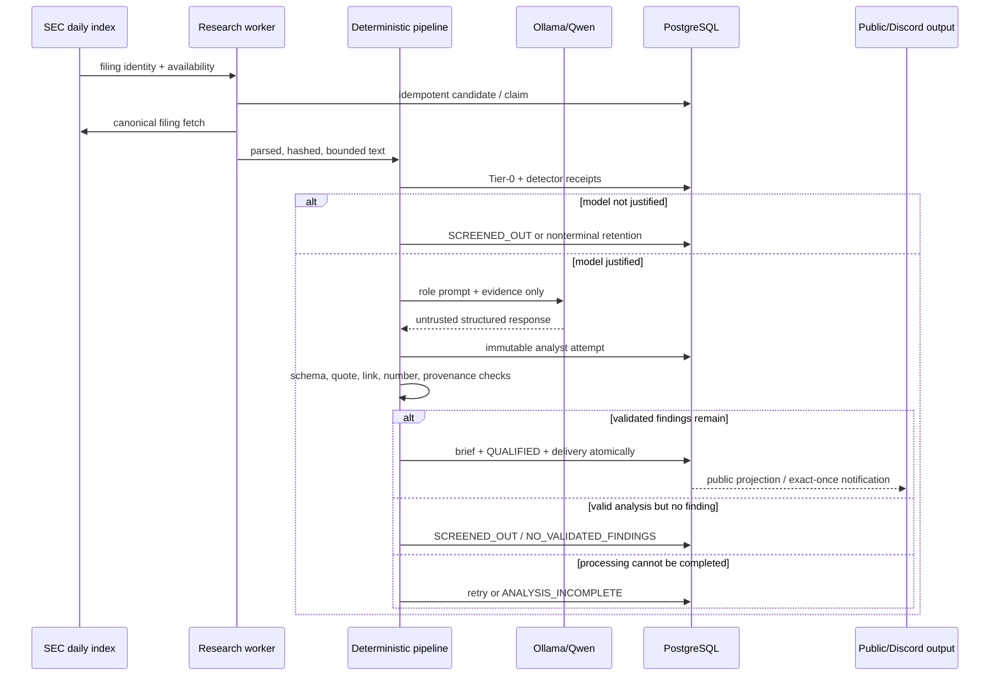

### Step 3: deterministic evidence and Tier 0

The pipeline builds hash-anchored evidence records and runs conservative forensic
detectors. Implemented examples cover share-count growth, liquidity pressure,
going-concern language, reverse splits, financing terms, ownership forms,
accounting/auditor events, filing changes, and contradictions. Detectors emit
status, explanation, evidence IDs, and calculation/rule versions—not free-form
model opinions.

Tier 0 returns one of:

- `SKIP`: deterministic policy establishes that expensive analysis is not
  justified. Prospective autonomous completion is recorded with an allowed reason.
- `RETAIN`: uncertainty or an unresolved deterministic condition warrants keeping
  the record without pretending analysis completed.
- `ESCALATE`: bounded material evidence justifies Qwen analysis.

Tier 0 is a compute-routing decision, not an investment ranking. Its JSON receipt is
stored before model work so restarts do not erase why the route was chosen.

### Step 4: CompanyFacts and numeric verification

For relevant filings, Kalki fetches SEC CompanyFacts and normalizes XBRL facts. A
numeric match is valid only when concept/tag, accession, form, unit, period/context,
and value constraints align. “The same number appeared somewhere in this filing” is
not enough. Ambiguous or missing contexts become `UNVERIFIABLE`; a contradictory
authoritative fact blocks the claim.

Numbers cited by the model are also checked against exact quoted evidence with
deterministic `Decimal` calculations, explicit tolerance, source hash, and
calculation version. The LLM is never asked to be the arithmetic authority.

### Step 5: serialized Qwen roles

Only `ESCALATE` candidates reach the accepted local model. The worker invokes two
closed roles—catalyst analysis and bull/bear/risk analysis—against bounded evidence.
The accepted Observation Baseline V2 lineage is:

| Field | Accepted value |
|---|---|
| Ollama model | `qwen3:4b` |
| Digest | `359d7dd4bcdab3d86b87d73ac27966f4dbb9f5efdfcc75d34a8764a09474fae7` |
| Quantization | Q4_K_M |
| Parameters | 4.02 billion |
| Context | 4,096 tokens |
| Maximum output | 768 tokens |
| Analyst prompt | `analyst-v2` |
| Schema/validator | `1.0.0` |
| Request concurrency | one (`OLLAMA_NUM_PARALLEL=1`) |
| Provider timeout | 300 seconds |

Every one of the 5,088 Phase 45 baseline analyst receipts used that exact lineage.
Serialization is deliberate: on the reference mobile CPU, parallel inference would
compete for memory bandwidth, extend tail latency, increase heat, and make recovery
behavior harder to interpret. Concurrency may change only after repeatable workload
measurements on capable hardware—not because a larger machine sounds faster.

The response is untrusted. Kalki checks JSON/schema shape, role, evidence references,
exact quotations, numeric consistency, source identity, provenance, and bounded
finding fields. Extra prose or a missing contract is rejected and recorded as an
attempt; it is not repaired by silently parsing around the error.

### Step 6: verifier boundary

**Disabled:** Gemma 4 12B has a bounded independent-verifier implementation and a
historical local qualification. It missed a material one-sided-risk case and took
roughly 11–12.5 minutes per CPU review on the reference host. It therefore remains
installed but unloaded/disabled in production. Gemma 3 was never accepted.

With the verifier flag off, a valid brief uses the explicit
`deterministic_only` publication receipt and records
`independent_verifier_status=disabled`. This is not a claim that no validation
occurred: deterministic validation remains mandatory. If the verifier were enabled
in a future approved experiment, disagreement would trigger one neutral bounded
retry and then quarantine; it could not overrule deterministic evidence.

### Step 7: final dispositions and publication

The final autonomous decision vocabulary is closed:

| Disposition | Meaning | Public dossier? |
|---|---|---:|
| `QUALIFIED` | Validated findings and all active publication/source/link gates passed | Yes, exactly once |
| `SCREENED_OUT` | Processing completed, but deterministic qualification was not met, no validated findings remained, evidence was insufficient, or an enabled verifier disagreed | No; public-safe row may appear on `/screened` |
| `ANALYSIS_INCOMPLETE` | Retrieval, parsing, CompanyFacts, provider timeout/failure, model contract, numeric/evidence/provenance validation, verifier, persistence, or bounded retry failed | No; aggregate counts only |

`retry_wait`, `pending`, and `processing` are nonterminal queue states. A bounded
failure may retry; exhaustion produces `ANALYSIS_INCOMPLETE`. Historical records
that predate prospective reasons remain `LEGACY_REASON_UNAVAILABLE`/`UNKNOWN`; Kalki
does not backfill an explanation by inference.

`NO_VALIDATED_FINDINGS` is healthy behavior: both model roles can return accepted
contracts while contributing no finding that survives the evidence gates. That
filing is screened out, not published. Likewise, alert silence can mean that the
worker is processing normally but current filings are deterministic skips, valid
no-finding screens, incomplete retries, or a bounded backlog. Health must be judged
from heartbeats, runs, queue transitions, attempt receipts, and terminal decisions,
not notification volume alone.

Publication atomically links an immutable schema-3 brief, its source and analyst
lineage, a `QUALIFIED` decision, and a notification head. Discord delivery claims
the head with row locking and records the provider message identity after success,
so retries do not recreate research or intentionally duplicate a notification.

## 5. Evidence provenance and validated links

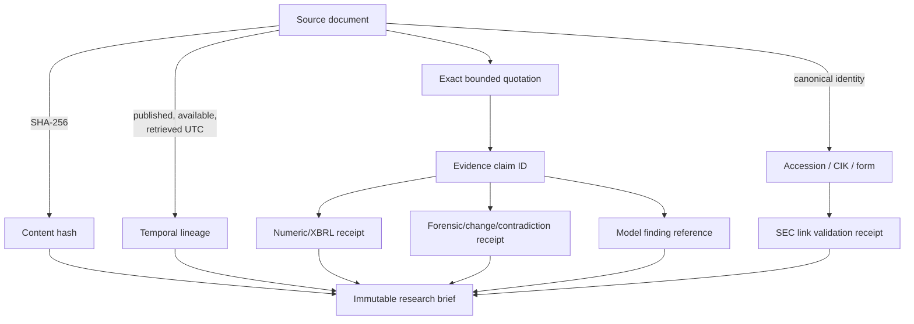

The canonical SEC-link validator restricts scheme, host, path, CIK/accession
relationship, and supported archive shape. Migration 0020 adds durable validation
receipts and the brief reference. Public pages render only the validated link. This
blocks a model or database string from turning an arbitrary URL into a trusted
source link.

Evidence timestamps have distinct meanings:

- `published_at`: publisher-declared publication time, when known;
- `available_at`: earliest authoritative availability Kalki can establish;
- `retrieved_at`: when Kalki obtained the bytes;
- `recorded_at`/`evaluated_at`: when a receipt was persisted or evaluated.

All internal timestamps are UTC. Unknown publication time stays unknown rather than
being replaced with retrieval time.

## 6. Freshness, novelty, changes, and Focus

### Filing freshness versus event freshness

A newly filed document is filing-fresh. Its content may repeat a months-old event.
Event freshness asks whether the underlying disclosure relationship is genuinely
new. Kalki records disclosures, searches bounded prior history, and links related
events. A newest filing can therefore be `KNOWN_RECAP` or `UNKNOWN_NOVELTY` instead
of novel.

### Event lineage and novelty

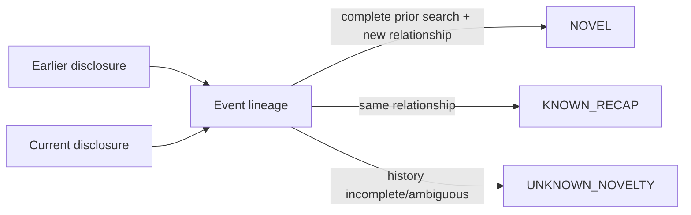

The state records current and prior disclosure IDs, the authoritative first-known
disclosure, evaluation time, disposition, bounded reason, and rule version. Novelty
is not inferred from word overlap alone. If prior-search completeness cannot be
proved, the outcome is `UNKNOWN_NOVELTY`. At the Phase 45 baseline, all six recorded
lineages were unknown because no safe prior relationship could be established.

### Filing-change intelligence

Phase 42 adds a deterministic lifecycle for comparable filings. Form-aware
extraction chooses meaningful sections, stores hash-anchored snapshots, selects a
prior filing without using future information, and emits additions/removals/
modifications. Whitespace-only movement is suppressed. Snapshot identity and
selection receipt are immutable; a later rerun cannot quietly switch the comparison
pair. Genuine financing prospectus pairs were used to validate fidelity, but change
receipts are not investment signals.

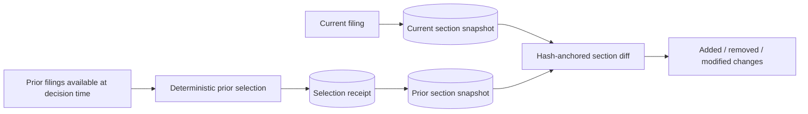

### Contradiction receipts

Phase 43 producers compare bounded, same-issuer/same-context channels and emit
supportive, contradictory, or unknown relationships. The convergence service keeps
primary, supporting, and lower-confidence sources separate; independent channels
are counted once. A contradiction receipt records the two claims, evidence lineage,
rule/calculation version, and reason. It is an auditable relationship—not an opaque
score and not a model debate.

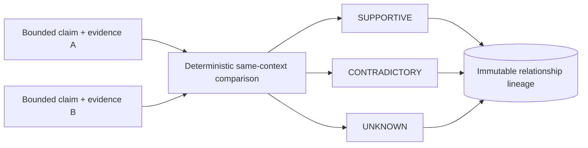

### Focus Universe

Focus is a prospective, append-only membership mechanism intended to bound expensive
attention. Membership changes carry issuer identity, action, reason, effective time,
universe version, and a supersedes link. It does **not** mean “best stocks,” a buy
list, or model conviction. It does not alter historical membership retroactively.

At Phase 45, the focus epoch existed but the membership history was empty. A
read-only 2026-09-09 check found the state initialized and still **zero membership
events**. Therefore no Focus performance, selection quality, or throughput benefit
can be reported.

### Adaptive compute and evidence budgets

Implemented routing combines:

- Tier-0 deterministic `SKIP`/`RETAIN`/`ESCALATE`;
- per-role bounded evidence windows and a total evidence-character budget;
- a process-local immutable analysis cache for identical work;
- serialized model requests;
- resource-governor/engineering measurement receipts;
- bounded batches, retry waits, and terminal retry exhaustion.

The cache is an efficiency mechanism, not a durable source of truth. Changing
evidence, model digest, prompt/schema, or analysis identity yields a different key.
The router does not dynamically choose unqualified large models, and it does not
enable concurrent models.

## 7. Specialized deterministic subsystems

### Ownership

**Implemented.** The ownership worker discovers bounded SEC ownership-form inputs,
normalizes issuer/reporting-owner identity, performs conservative Tier-0 routing,
and writes job, receipt, and routing ledgers. Migration 0016 corrected index
identity prospectively. Ownership data is evidence about disclosed ownership—not a
claim about future returns.

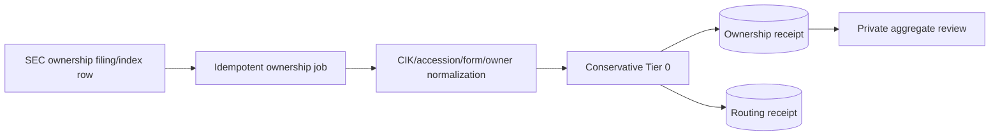

### Financing and dilution

**Implemented.** The financing worker recognizes closed families such as priced
offerings, shelf/ATM capacity, warrants/repricing, convertible instruments, equity
lines, and debt terms when exact filing evidence supports them. It stores terms and
routing receipts, or the explicit `no_terms` result. It does not calculate an
unbounded “dilution score” or assume all authorized capacity will be issued.

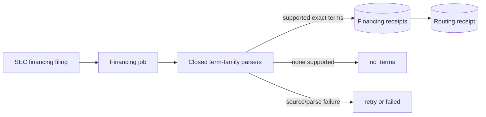

### Accounting, auditor, and compliance

**Implemented.** Form-aware parsers cover bounded auditor changes, reportable-event
language, late-filing notices, and related compliance evidence. Jobs terminate as
completed, `no_events`, retry, or failed. The subsystem records what the filing
supports and does not diagnose fraud.

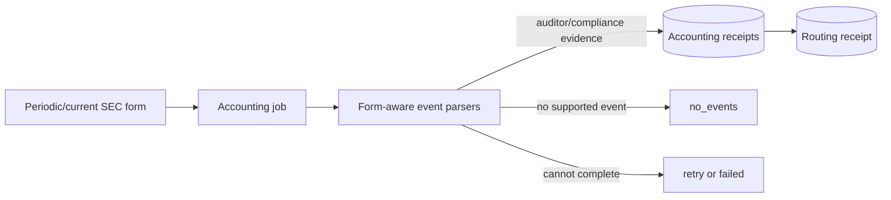

### Human research intake

**Optional and private.** An allowlisted Discord Gateway listener validates a single
configured channel, stable user ID, bounded content, ticker/CIK syntax, safe public
HTTP(S) pointers, dedupe identity, and payload size. Human text is stored as a
hypothesis, never as authority or instructions. It is not concatenated into a shell
command or promoted to evidence.

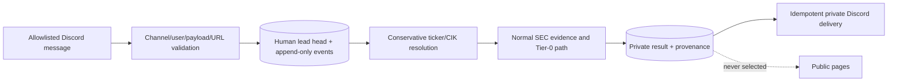

Ticker-only leads resolve through the SEC ticker map and bounded submissions
history. Ambiguous or unavailable identity returns insufficient evidence. Human
results and feedback remain private and immutable; legacy rows missing modern
origin fields stay `UNKNOWN`.

## 8. Public site and private Mission Control

| Route | Audience | Actual purpose |
|---|---|---|
| `/` | Public | Redirects to `/radar` |
| `/radar` | Public | Qualified immutable filing dossiers |
| `/research` | Public | Combined qualified research-library projection; never human intake |
| `/screened` | Public | Completed autonomous screened-out filings with safe reason and validated SEC link |

The public application intentionally has no admin, login, health, documentation,
OpenAPI, worker-error, or raw-database route. `/screened` excludes
`ANALYSIS_INCOMPLETE` detail; only bounded rolling aggregates may acknowledge that
incomplete work exists.

The private admin process supplies authenticated Mission Control views: queue and
terminal counts, worker heartbeats, delivery reconciliation, bounded failure
categories, resource samples, and observation reports. Credentials and the login
URL are operator-private. Authentication uses an Argon2 password hash from a secret
file, bounded sessions, secure-cookie configuration, rate limits, generic login
errors, and append-only security events. It is bound only to loopback and must not
be tunneled.

## 9. PostgreSQL ledgers and identity

| Ledger family | Mutable head / identity | Append-only or immutable evidence |
|---|---|---|
| Autonomous radar | candidate by accession; worker status and delivery head | runs, attempts, Tier-0 JSON, screening decisions, briefs, delivery history |
| Verifier | retry/disposition head by candidate | verifier reviews and operation counters |
| Funnel | singleton/current telemetry state | pipeline and detector receipts |
| Human research | lead/result/delivery heads with dedupe/message identity | lead events, feedback, result provenance |
| Prospective outcomes | job head by publication×horizon×provider | plans, attempts, outcomes |
| Ownership | source/job identity by filing/form/owner | normalized receipts and routing receipts |
| Financing | job identity by filing | term receipts and routing receipts |
| Accounting | job identity by filing | event receipts and routing receipts |
| Novelty | current state by event identity | disclosures and event-lineage evaluations |
| Focus | singleton epoch/current policy | membership events with supersession |
| SEC links | current validation state by link identity | validation receipts referenced by briefs |
| Measurements | current metric state | metric catalog, measurements, filing-latency receipts |
| Filing changes | current lifecycle selection | immutable snapshots and prior-selection receipts |
| Contradictions | identity from compared claims/rule | contradiction receipts |
| Predictions | prediction identity | corrections and outcomes; currently empty |

Idempotency keys are constructed from stable domain identity—typically accession,
source hash, role/attempt, message ID, or publication/horizon/provider—not from a
random retry timestamp. Workers claim with row locks, commit an attempt with its next
state atomically, and treat duplicate insert conflicts as evidence that the logical
event already exists. Foreign keys keep receipts tied to the same candidate/source.
Database triggers and grants reject mutation of protected history.

### Migrations 0001–0027

| Migration | Conceptual change |
|---:|---|
| 0001 | Prediction, correction, outcome, and migration ledgers with immutable-history foundations |
| 0002 | Admin sessions, login attempts, request events, and security-audit events |
| 0003 | Read index for public publication listing |
| 0004 | Live radar candidates, runs, worker state, briefs, and notification delivery |
| 0005 | Independent verifier reviews, retry/disposition state, counters, and candidate/brief lineage |
| 0006 | Durable Tier-0 outcome/reason/evidence JSON on candidates |
| 0007 | Human lead heads plus append-only lead events |
| 0008 | Append-only bounded human feedback |
| 0009 | Private human results and idempotent result-delivery heads |
| 0010 | Immutable per-role analyst-attempt receipts and accepted-Qwen lineage |
| 0011 | Funnel state plus append-only pipeline and detector telemetry |
| 0012 | Explicit human-result origin/provenance fields |
| 0013 | Closed prospective autonomous screening decisions and public-safe epoch state |
| 0014 | Prospective outcome plans, jobs, attempts, and immutable outcomes |
| 0015 | Ownership state, jobs, normalized receipts, and routing receipts |
| 0016 | Corrected ownership job/index identity |
| 0017 | Financing state, jobs, term receipts, and routing receipts |
| 0018 | Event disclosures, novelty state, and immutable lineage |
| 0019 | Focus epoch/state and append-only membership changes |
| 0020 | Canonical SEC-link state/receipts and brief linkage |
| 0021 | Metric definitions/state, engineering measurements, and filing-latency receipts |
| 0022 | Accounting state, jobs, event receipts, and routing receipts |
| 0023 | Validation support for canonical complete-submission archive paths |
| 0024 | Wider/stable attempt-latency storage used by stale-attempt recovery |
| 0025 | Filing-change snapshots and immutable comparison selection |
| 0026 | Deterministic contradiction receipts |
| 0027 | Database-enforced prospective outcome-science invariants |

Migration scripts are guarded and idempotent, but applying them is still a
production change. Back up, validate the restore in an isolated disposable database,
apply in numeric order, and verify the ledger. There is intentionally no casual
destructive down-migration for append-only research history.

## 10. Outcome science

**Implemented methodology, unavailable sample.** A plan preregisters publication,
reference and target exchange sessions (T+1/T+5/T+20), provider, benchmark rule,
and whether observation is genuinely forward or reconstructed. Provider attempts
preserve exact bar payload hash and availability. Deterministic `Decimal` code
computes split-adjusted asset and SPY-relative returns. Missing data appends
`data_unavailable`; it is not invented.

Reconstructed rows may be shown in data-quality counts but are excluded from forward
means, calibration, and minimum-sample thresholds. Wilson intervals are descriptive,
not proof of alpha. Migration 0027 prevents invalid session ordering, post-target
availability, origin drift, and mutation.

The worker and schema exist, but the Compose profile is **disabled**, the optional
provider is **disabled**, no account/key/live bars exist, and all outcome tables were
empty at both Phase 45 and the 2026-09-09 read-only check. The only truthful report
is `INSUFFICIENT_SAMPLE`.

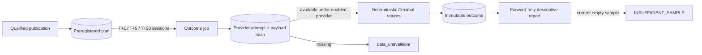

## 11. Testing and acceptance architecture

Tests are layered:

1. Pure unit/contract tests for UTC, hashes, identifiers, parsers, routing, evidence
   budgets, schema rejection, arithmetic, and no-look-ahead behavior.
2. Controlled fixtures, including synthetic prices and reusable SEC filings, for
   deterministic replay. Synthetic cases test mechanics, not market accuracy.
3. PostgreSQL integration tests behind opt-in environment gates.
4. Disposable Docker lifecycle scripts for each migration family, grants,
   idempotency, update/delete rejection, and crash/reclaim behavior.
5. Backup/restore validation in a network-disabled temporary PostgreSQL container.
6. Model benchmarks with fixed cases, exact digest lineage, latency, token, and
   resource capture. Qualification never substitutes for runtime validation.
7. Public/private route tests, accessibility checks, Compose rendering, non-root and
   read-only filesystem smoke tests.
8. Ruff formatting/linting, strict mypy, dependency-lock consistency, shell syntax,
   and `git diff --check`.

Tests that need live PostgreSQL, SEC, Ollama, Discord, Cloudflare, or a market-data
account are explicitly opt-in. Normal tests must not send notifications, publish a
research record, change DNS, or mutate production.

## 12. Evolution through Phase 45

These are engineering milestones, not marketing claims.

| Phase | Accepted scope |
|---:|---|
| 1 | Repository/package, immutable configuration and evidence/domain foundations |
| 2 | Local Ollama installation and representative model benchmark |
| 3 | SEC recent-submission and CompanyFacts ingestion foundations |
| 4 | SEDAR+ architecture/contracts only; no comprehensive live adapter |
| 5 | Provider-neutral market-data contracts and offline fixtures |
| 6 | Deterministic point-in-time quantitative primitives |
| 7 | Closed structured analyst pipeline and injection-resistant evidence boundary |
| 8 | Transparent deterministic signal policy, initially uncalibrated |
| 9 | Prediction/correction/outcome immutable ledgers |
| 10 | Optional exactly-once Discord outbound delivery |
| 11 | Public dashboard and authenticated private admin |
| 12 | Hardened production Compose and optional approved Cloudflare boundary |
| 13 | Deterministic backtester with synthetic-only evidence |
| 14 | Measured resource optimization; optional providers kept disabled |
| 15 | Continuous SEC filing radar and public evidence pages |
| 16 | Evidence Observatory redesign and workload-specific model selection |
| 17 | Independent Gemma verifier experiment; rejected for production |
| 18 | Source grading, numeric checks, filing diffs, forensics, and tier routing |
| 19 | CompanyFacts/XBRL wiring and durable Tier-0 decisions |
| 20 | Provenance-rich escalation dossiers and private projection |
| 21 | Forward versus reconstructed outcome methodology |
| 22 | Descriptive Wilson calibration with inconclusive sample gate |
| 23 | Authority-aware convergence primitives |
| 24 | Public deterministic numeric-receipt provenance |
| 25 | Reconstructed outcomes excluded from forward statistics |
| 26 | Independent-channel convergence lineage |
| 27 | Documented prediction-origin schema boundary; no provenance was invented |
| 28 | Private human lead contracts, queue, events, and Discord boundary |
| 29 | Private Mission Control health/operations projection |
| 30 | Append-only human feedback and observation mode |
| 31 | Private human execution/results and idempotent delivery |
| 32 | Production recovery for CompanyFacts metadata and canonical CIK behavior |
| 33 | Durable analyst-attempt receipts and measured Qwen reliability recovery |
| 34 | Funnel telemetry and Mission Control reconciliation |
| 35 | Consistent public `/radar`, `/research`, and `/screened` model |
| 36 | Explicit human-result provenance and private/public enforcement |
| 37 | Prospective $0 outcome schema/worker; provider remains disabled |
| 38 | Backup, restore, immutable migration, and recovery acceptance gate |
| 39 | Ownership intelligence subsystem |
| 40 | Financing and dilution evidence subsystem |
| Post-40 gate | Freshness/efficiency/focus program: novelty, focus, validated links, measurement ledger, cache, evidence budgets, adaptive routing |
| 41 | Accounting, auditor, and compliance subsystem |
| 42 | Filing-change lifecycle and form-aware comparison |
| 43 | Deterministic contradiction/convergence receipts |
| 44 | Preregistered outcome-science invariants and honest calibration reporting |
| 45 | Integrated gates and frozen Observation Baseline V2 |

## 13. Observation Baseline V2

Phase 45 froze feature development so real operations could be observed without
moving the model, schema, prompts, thresholds, or evaluation rules underneath the
sample. It is a reproducibility boundary, not a claim that the project is finished.

At freeze time the accepted database had 2,689 candidates, 3,232 runs, 140 qualified
screening decisions, 1,671 screened out, 196 analysis incomplete, 147 briefs and
147 delivery records, and 5,088 analyst attempts. There were 12 private human leads
and 12 private results. Deterministic backlogs remained in ownership, financing, and
accounting. Six event lineages were all `UNKNOWN_NOVELTY`; Focus had no membership
events; prediction and prospective-outcome ledgers were empty. A later read-only
snapshot may have larger operational counts because polling continues, but it must
not be substituted for the frozen acceptance manifest.

Current limitations to keep visible:

- no outcome/prediction sample and therefore `INSUFFICIENT_SAMPLE`;
- bounded pending/retry/failed queues in the specialized workers;
- unknown novelty where prior-search completeness is unavailable;
- no Focus membership history or Focus evaluation;
- Gemma verifier disabled;
- model concurrency disabled and Qwen serialized;
- optional market-data provider disabled and no live market-data rights accepted;
- Canadian source contracts exist without comprehensive production coverage;
- a local model can still time out or reject its output contract;
- no result implies investment performance.

## Glossary

**Accession number** — SEC filing identity, used as a core idempotency key.
**Analysis incomplete** — Terminal evidence that processing could not safely finish;
not a negative issuer judgment.
**Availability time** — Earliest time evidence can be established as accessible for
point-in-time use.
**Brief/dossier** — Immutable public-safe qualified research record.
**Candidate** — Durable filing work head before terminal disposition.
**Canonical CIK** — SEC issuer identifier normalized to ten digits.
**CompanyFacts** — SEC JSON collection of issuer XBRL facts and contexts.
**Contradiction receipt** — Versioned deterministic relationship between two bounded
claims.
**Evidence ID** — Stable identity linking a claim to source bytes/quotation.
**Fail closed** — Withhold/mark unknown when a positive safety condition is absent.
**Focus Universe** — Prospective bounded attention membership, not a recommendation
list.
**Forward observation** — Outcome plan fixed before its target data became available.
**Human lead** — Private untrusted hypothesis submitted by an allowlisted researcher.
**Idempotency** — Repeating an operation produces no duplicate logical record.
**Immutable ledger** — History that is appended/corrected, not updated in place.
**Lineage** — Identities, hashes, times, rules, and links explaining derivation.
**Novelty** — Whether the underlying event relationship is new, recap, or unknown.
**Point-in-time correctness** — Using only evidence available by the decision time.
**Qualified** — All current publication gates passed; not an investment label.
**Reconstructed observation** — Historical evaluation created after target data could
already be known; excluded from forward claims.
**Screened out** — Completed evaluation with no publishable validated finding.
**Tier 0** — Cheapest deterministic compute-routing layer.
**Validated finding** — Bounded statement whose exact evidence, numbers, source, and
schema pass the active gates.
**Verifier** — Optional second semantic model behind deterministic gates; disabled in
the accepted baseline.
**XBRL** — Structured filing facts with concept, unit, period, and context metadata.
