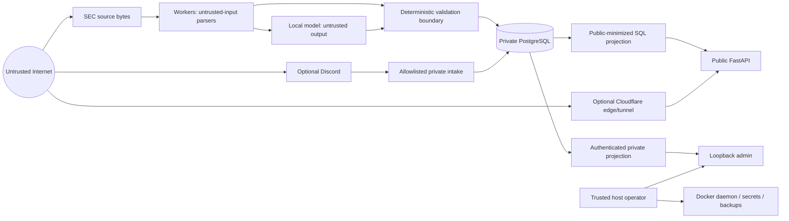

# Security model and threat boundaries

Kalki processes hostile Internet content, untrusted model output, optional human
messages, credentials, and market-sensitive research on one self-hosted machine.
Its security goal is to minimize authority, network reach, data exposure, and silent
failure—not to claim perfect isolation.

## Assets to protect

- PostgreSQL research/provenance history and availability;
- private human hypotheses, identities, feedback, results, and message metadata;
- database, admin, Discord, tunnel, and optional-provider credentials;
- admin sessions and security audit events;
- source/model/configuration integrity and accepted Observation Baseline lineage;
- host filesystem, Docker socket, model files, backups, and operator account;
- public-page integrity: no unsupported claim, unsafe link, or private field.

## Adversaries and failure sources

- malicious text/HTML in an SEC filing or linked source;
- prompt injection and malformed output from local models;
- unauthorized Internet visitor probing the public process;
- forged Host/forwarding headers or unsafe URL input;
- unauthorized Discord sender, compromised bot/webhook, or replayed event;
- stolen secret/backup/operator account;
- vulnerable dependency, container image, or host daemon;
- accidental operator exposure, mutable-image rollback, destructive recovery, or
  public log paste;
- bugs that introduce look-ahead, duplicate publication, broken provenance, or
  cross-issuer evidence.

Kalki does not protect a host after an attacker obtains root or unrestricted Docker
socket access. It does not provide multi-tenant hostile-code isolation, a WAF, DDoS
absorption by itself, encrypted PostgreSQL fields, or encrypted off-host backups.

## Trust boundaries

### Boundary 1: Internet source to parser

Source bytes are data, never executable instructions. SEC clients restrict HTTPS
hosts and path shapes, rate/timeout/size, validate content and issuer/accession
identity, hash bytes, and retain retrieval time. HTML is parsed to visible bounded
text. Human URLs accept only constrained public HTTP(S) pointers and require
separate safe retrieval validation.

### Boundary 2: evidence to model and back

The model receives only bounded evidence and a versioned role prompt. Filing/human
text cannot supply system instructions. Returned JSON is untrusted and must pass
schema, role, evidence-ID, exact-quotation, numeric/XBRL, source, provenance, and
publication validation. Extra prose, unknown fields, mismatched numbers, or missing
evidence fail closed. Deterministic code—not a model—computes metrics.

### Boundary 3: database to public output

Public repository methods select a minimal safe column set from qualified briefs or
screened-out autonomous decisions. They never select human lead/result/feedback
tables, raw attempts, prompts, response text, internal errors, sessions, Discord IDs,
or Mission Control telemetry. Canonical SEC links require a validation receipt.

### Boundary 4: private operator and external connectors

Admin is loopback-only and authenticated. The optional Cloudflare connector can
reach only public FastAPI on its dedicated network. Discord intake uses one
token-mounted service, one channel, stable-ID allowlist, bounded content, and durable
dedupe. External services have their own terms, logs, account compromise, and data-
handling risks.

## Network segmentation

| Network | Members/purpose | Internet reach |
|---|---|---|
| `database` (`internal`) | PostgreSQL and application consumers | No direct external routing |
| `analyst` (`internal`) | research worker and Ollama | No direct external routing |
| `admin` | private admin side | Host publishes only loopback 8000 |
| `public_connector` | public process and optional cloudflared | Connector can reach public only |
| `research_egress` | source workers/intake needing outbound HTTPS | Outbound according to Docker/host policy |

PostgreSQL 5432 and Ollama 11434 have no host port. Public 8001 and admin 8000 bind to
`127.0.0.1`. SSH is a host concern and should be restricted separately. Docker's
firewall behavior must be understood; a future `ports:` edit can bypass expected UFW
policy.

## Container and filesystem controls

Application images use a non-root UID (10001). The private intake currently uses a
host-matching non-root UID/GID for secret readability. Application, worker, intake,
and Ollama roots are read-only with bounded `/tmp` tmpfs. Capabilities are dropped,
`no-new-privileges` is enabled, and CPU, memory, PID, and sometimes swap limits are
defined. This reduces damage from an application exploit; it is not a VM boundary.

PostgreSQL requires a writable named volume and the official image's initialization
behavior, so its filesystem/UID controls differ. It uses data checksums, an owner
credential for migration/recovery, and a distinct least-privileged application role.

The application build context excludes `.git`, `.env*`, secrets, backups, data,
logs, models, raw data, caches, and temporary files. Runtime secrets are read-only
file mounts under `/run/secrets`; they are not baked into the image or passed as
command arguments.

## Secret handling

- One secret per ignored file, one line, no label unless the consumer requires it.
- `secrets/` mode 0700; files limited to the operator/container UID. Never use 0777.
- `.env` contains non-secret runtime settings and may include a contact identity; it
  is still private and mode 0600.
- Never print, log, screenshot, paste, commit, bake, or pass a secret on a CLI argument.
- Database owner and app passwords are independent. The app never receives owner
  credentials.
- Admin stores an Argon2id hash, not plaintext.
- Discord bot/webhook and Cloudflare tunnel-scoped tokens stay in the one service
  that requires each. Never use a broad Cloudflare global key.
- Rotation requires provider revocation and coordinated service/database changes.
  History cleanup cannot revoke a credential.

The repository's public-release audit currently blocks publication because private
Discord IDs and home paths—not credential values—remain tracked/history-visible.
See [Public Release Audit](PUBLIC_RELEASE_AUDIT.md).

## Public web controls

- separate public FastAPI factory and route table;
- no public admin, health, docs, ReDoc, or OpenAPI endpoint;
- trusted Host enforcement and bounded request rate;
- generic errors without stack traces/private exception text;
- public-safe SQL projections and escaped templates;
- restrictive security headers and no third-party web fonts/assets;
- canonical validated SEC links;
- only qualified dossiers or closed screened-out records; incomplete details private.

The optional tunnel terminates an external boundary. Cloudflare can observe request
metadata and operates under its own account settings/terms. Origin loopback/network
segmentation remains necessary even behind a tunnel.

## Private admin controls

- loopback-only port and route factory distinct from public;
- Argon2id password verification;
- random bounded server-side sessions with idle/absolute expiry;
- Secure-cookie support for an approved HTTPS private front end; baseline loopback
  HTTP does not falsely set it;
- login and request rate limiting;
- generic authentication failures;
- append-only request/login/security event ledgers;
- no credential or raw model trace in rendered Mission Control.

Do not put admin behind the public Cloudflare route. If remote administration is
needed, prefer a private SSH/VPN/Access design that has been separately threat-
modeled.

## Human research privacy

Human submissions can identify a person and reveal private research intent. They are
stored in private lead/event/result/feedback/delivery tables and excluded at the
query boundary from public views. Stable Discord IDs are authorization identifiers
and personal metadata even though they are not passwords. Message content is
untrusted hypothesis data, never public authority.

Backups and logs inherit this sensitivity. A database dump is not safe to attach to
an issue or use as a public demo. Tests must use synthetic identities/content.

## Database integrity and least privilege

Domain uniqueness, foreign keys, closed enum/check constraints, relational-versus-
JSON consistency, same-accession relationships, and triggers enforce invariants.
Protected ledgers reject update/delete by application roles. Claims use row locking;
attempt completion and next state commit atomically. Corrections and membership
changes append superseding records.

Migrations run as owner only after backup/restore gates. The application role
receives only needed table/sequence/function rights. PostgreSQL is never publicly
reachable. SQL injection defenses still require parameterized queries; least
privilege limits consequences but does not excuse unsafe SQL.

## Availability and resource controls

Bounded batches, response sizes, evidence budgets, retries, timeouts, queue caps,
read-only roots, tmpfs limits, PID/memory/CPU limits, and serialized inference reduce
resource exhaustion. Public and database processes have independent limits so a long
model call need not take the site down. A local attacker or pathological workload
can still fill disk, overheat hardware, or starve the host; monitor and preserve
headroom.

## Supply-chain and release controls

- Python runtime and development dependencies are exactly pinned in lock files.
- production base images are digest-pinned; local Kalki images still need an
  immutable tag/digest record;
- Qwen is pinned by model digest plus prompt/schema/validator versions;
- builds exclude local secrets/data;
- tests include dependency consistency, Compose rendering, non-root/read-only smoke,
  migrations, restore, and route boundaries.

Apache-2.0 has been selected for owner-authored source, and the clean-history export
avoids publishing historical private identifiers and paths. Remaining release gates
include a maintained local scan of the final export, account-side GitHub security
review, SBOM/container vulnerability reporting, and dependency-update automation.
See the [release-candidate manifest](PUBLIC_RELEASE_CANDIDATE.md).

## Threat/control matrix

| Threat | Main controls | Residual risk |
|---|---|---|
| Filing prompt injection | data-only evidence, role prompts, schema/quote/provenance checks | semantic manipulation can still yield rejected/incomplete analysis |
| Model hallucination | exact citations, numeric/XBRL validation, fail-closed publication | supported quotation can still be interpreted poorly |
| Cross-issuer/source mix | CIK/accession/form/hash/FK checks | upstream issuer metadata defects require review |
| Look-ahead bias | published/available/retrieved times, prospective plans, DB invariants | missing source availability remains unknown |
| Duplicate work/alerts | domain idempotency, locks, unique constraints, delivery receipts | external provider may accept a request before local receipt commits |
| Public private-data leak | separate app/query/template, route tests, connector network | future query/template regression |
| Credential theft from Git/image | ignored file secrets, dockerignore, mounts | operator can force-add or leak logs/backups |
| Database compromise | internal network, app role, immutable triggers, backups | host/Docker-root compromise defeats boundary |
| SSRF/open redirect | constrained URL/source validators | new providers require new allowlists/tests |
| Resource denial | limits, budgets, serialization, retries | disk/thermal/SEC outage remains possible |
| Mutable deployment rollback | commit/image/model digest records | operator may rebuild/reuse a tag incorrectly |

## Security verification checklist

- public route factory contains no admin/health/docs/OpenAPI routes;
- local public `/admin`, `/health`, `/docs`, `/openapi.json` return 404;
- only loopback ports 8000/8001 are published;
- PostgreSQL/Ollama are absent from host listeners;
- Cloudflare network cannot reach admin/database/model;
- app containers are non-root, read-only, capability-free, no-new-privileges;
- secrets/data/backups/logs/models are ignored and outside image context;
- public SQL selects no human/attempt/internal fields;
- all public SEC URLs have validation receipts;
- Qwen digest/concurrency match baseline; Gemma/provider are disabled;
- backup restores in a network-disabled disposable database;
- full tests/static/Compose/diff checks pass for the exact release;
- current and full Git history pass a maintained secret/privacy scan;
- GitHub private vulnerability reporting and branch protection are configured.

## Incident response

1. **Contain:** stop the affected connector/worker, not the whole host blindly;
   preserve database availability where safe.
2. **Preserve:** record UTC time, commit/image/model/schema identity, bounded logs,
   receipt IDs, and a verified backup. Do not rewrite evidence.
3. **Revoke:** if a credential might be exposed, revoke/rotate at the provider first.
4. **Assess:** determine public/private scope, data accessed, and whether Git history,
   logs, images, backups, forks, or caches contain it.
5. **Recover:** use a reviewed immutable image and restore into a new database if
   necessary; verify boundaries before reconnecting.
6. **Disclose:** use the repository's [security policy](../SECURITY.md) and applicable
   legal notification requirements. Never publish exploit details or private data
   before containment.

## Explicit non-controls

Kalki does not provide brokerage protections, guaranteed correctness, investment
suitability, anonymous hosting, perfect source availability, anti-DDoS capacity,
secret management hardware, automatic off-host encryption, or automatic legal/
license compliance. Operators retain responsibility for host hardening, credentials,
backups, account terms, and public exposure.
